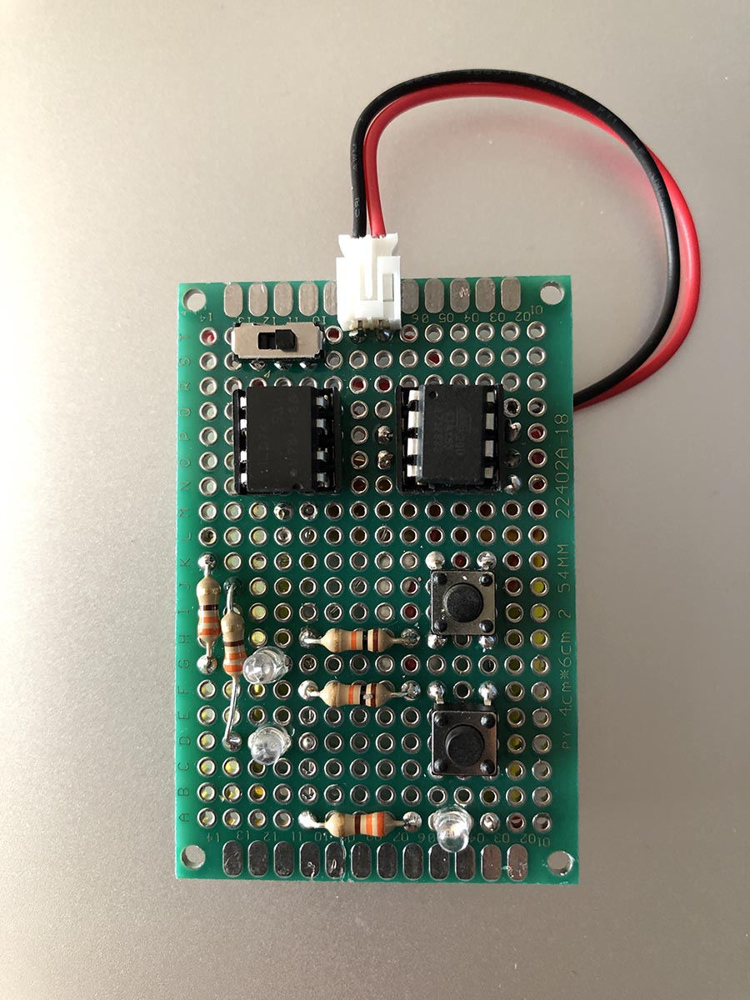

# Arduino washing machine delayed start
This is a little circuit to delay the start of a washing machine.
Can be used to delay anything via an optocoupler.

## How to use
When powering on the circuit, the status LED shows the default number of hours it will wait before triggering the optocoupler. Left button allows to increment that number by one hour on each pression (max 9 hours). Once set, the countdown starts when you press the button on the right.

The status LED shows the remaining hours left until the trigger.

The start of my washing machine consists in two steps :
* switch on;
* start washing;

Hence, the 2 channel optocoupler. A status LED is linked with each channel to allow troubleshooting.

When everything is done, the status LED will blink several times each 5 seconds to let you know you have to switch off the circuit.

## Parts list
* arduino :
  - development platform : arduino nano
  - target platform : attiny85
* optocoupler : ILS74 https://www.vishay.com/docs/83640/ild74.pdf
* 3 LEDS
* resistors
  - 3 * 330 ohms for the LEDS
  - 2 * 10k ohms for pullups
* 1 * lipo battery (3.7 V)

## Platform configuration
### development
  * type of card : Arduino nano
  * processor : Atmega 328P (old bootloader)
  * programmer : ArduinoISP

### target
  * type of card : ATtiny25/45/85
  * processor : attiny85
  * clock : internal 1MHz
  * programmer : Arduino as ISP

## Documentation
To use arduino as ISP, I followed instructions available here : https://create.arduino.cc/projecthub/arjun/programming-attiny85-with-arduino-uno-afb829

Information about optocouplers : http://www.martyncurrey.com/arduino-with-optocouplers/
